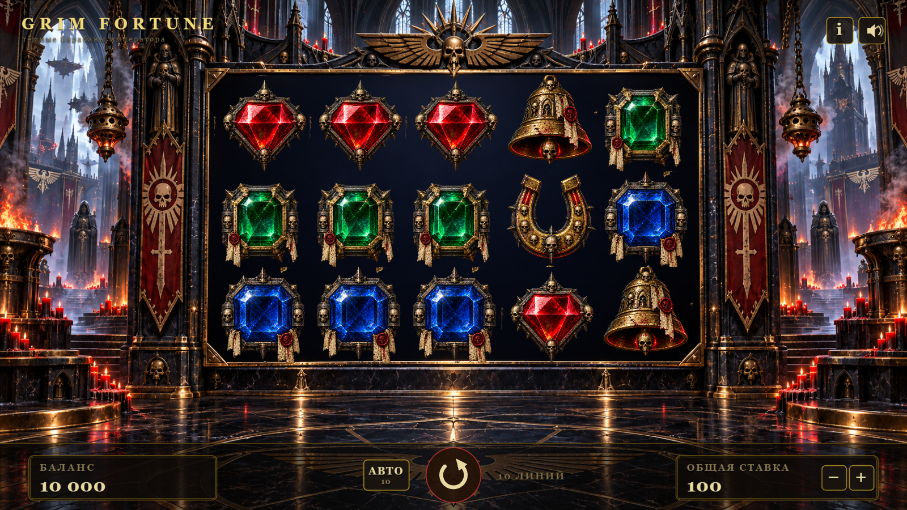

# GRIM FORTUNE — готический видеослот на PixiJS 8

Мрачный слот в стилистике тёмного готического собора: 5×3 барабанов, 10 фиксированных линий, 9 символов, RTP **95.02%** (проверено симуляцией 10 000 000 спинов).



## Запуск

```bash
npm install
npm run dev        # http://localhost:5173
```

Прод-сборка:

```bash
npm run build      # dist/
npm run preview    # http://localhost:4173
```

## Управление

| Действие | Мышь | Клавиатура |
|---|---|---|
| Спин / быстрый стоп | кнопка ⟳ | `Space` |
| Ставка ± | `−` / `+` | `↑` / `↓` |
| Автоигра 10/25/50/∞ | `АВТО` | `A` |
| Таблица выплат | `i` | `I` / `P` / `Esc` — закрыть |
| Звук | динамик | `M` |

Баланс, ставка и mute сохраняются в localStorage между сессиями.

## Математика

- 5 барабанов × 3 ряда, 10 фиксированных линий, выигрыш слева направо (3/4/5).
- Виртуальные ленты (веса в `src/game/config.ts`), исход спина фиксируется **до** начала анимации.
- RTP **95.02%**, hit rate ≈ 17%, джекпот — 5 корон = 1500× общей ставки.
- Проверка: `npm run simulate` (точный расчёт + Монте-Карло), `npm run selftest` (инварианты).

## Архитектура

```
src/
├── main.ts              # PIXI Application, загрузка, letterbox 1920×1080
├── layout.ts            # дизайн-разрешение, зона барабанов из тёмной зоны фона
├── assets.ts            # нарезка атласа 3×3 (frame'ы, без препроцессинга)
├── audio.ts             # WebAudio-синтез SFX (без аудиофайлов)
├── core/rng.ts          # mulberry32 (seedable)
└── game/
    ├── config.ts        # символы, выплаты, линии, ставки, ленты, тайминги
    ├── math.ts          # spinResult / evaluate / needsAnticipation (без pixi!)
    ├── Game.ts          # конечный автомат: idle→spinning→presenting/bigwin
    ├── ReelsView.ts     # движок барабанов: разгон/ход/дрейф/отскок, blur, anticipation
    ├── WinPresenter.ts  # трассы линий, пульс символов, счёт выигрыша
    ├── BigWinOverlay.ts # заставки 15×/30×/60× с искрами
    ├── PaytableView.ts  # таблица выплат и схема линий
    └── Ui.ts            # HUD: баланс/ставка/выигрыш/спин/автоигра/mute
tools/
├── analyze-bg.mjs       # измерение тёмной зоны фона (для layout)
├── simulate.ts          # RTP: аналитика + Монте-Карло (npm run simulate)
├── selftest.ts          # инварианты математики (npm run selftest)
└── smoke.mjs            # браузерный smoke-тест на Playwright (node tools/smoke.mjs)
```

Спецификации — в `openspec/` (spec-driven): поведение слота описано capabilities `slot-math`, `reel-presentation`, `game-ui`, `asset-pipeline`, `audio-sfx`.

## Отладка

- `?debug=1` — хук `window.__grim` (grid/result/state/balance/history) для тестов.
- `?forceWin=1` — каждый спин выравнивает короны по центральной линии.
- `node tools/smoke.mjs` — headless-прогон: спины, skip, сверка сетки с исходом, скриншоты в `screenshots/`.

## Стек

- [PixiJS 8](https://pixijs.com/) (WebGL/WebGPU), TypeScript strict, Vite.
- Ноль внешних ассетов кроме двух исходных PNG; звук синтезируется на лету.
